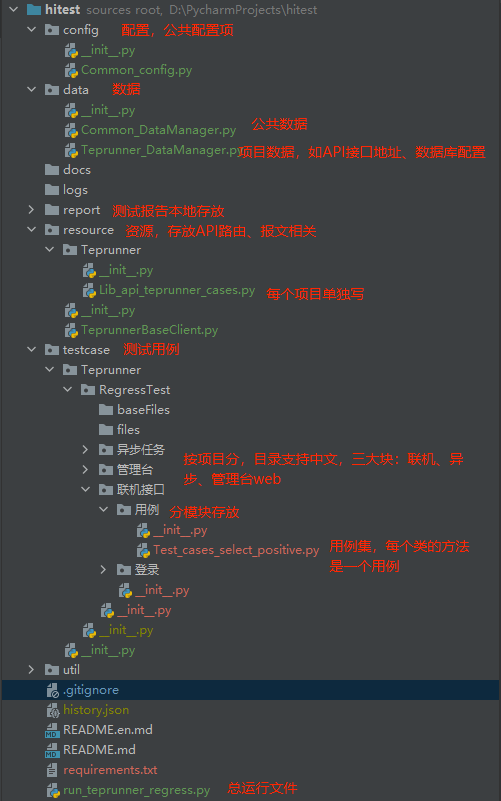
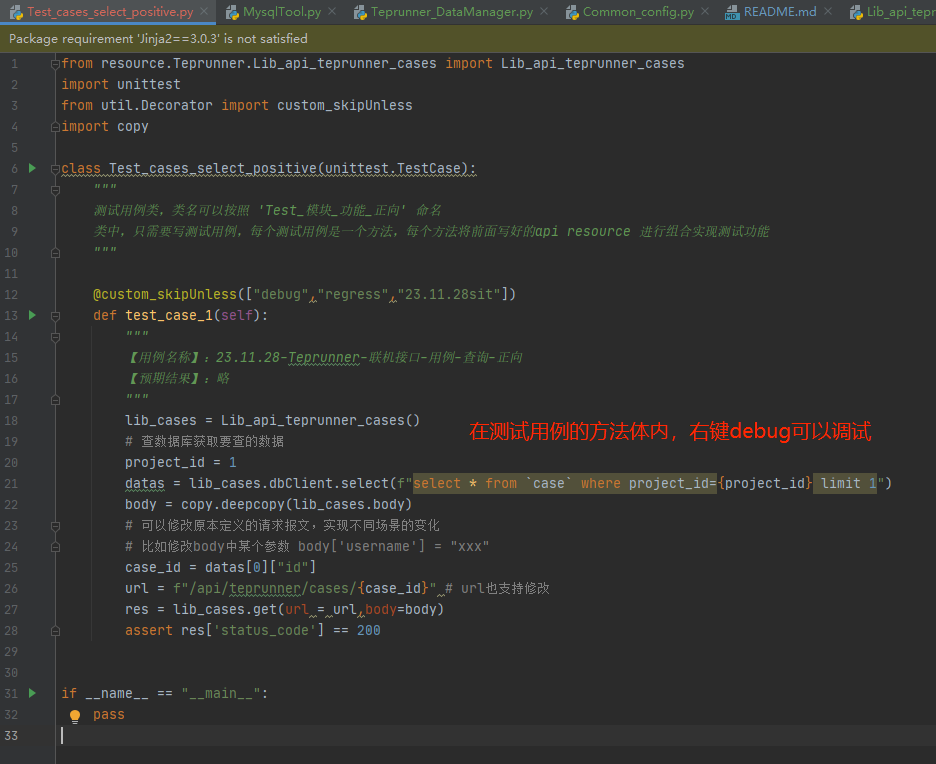
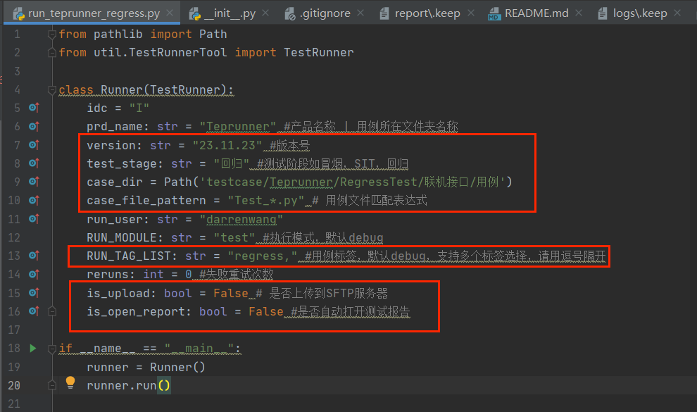
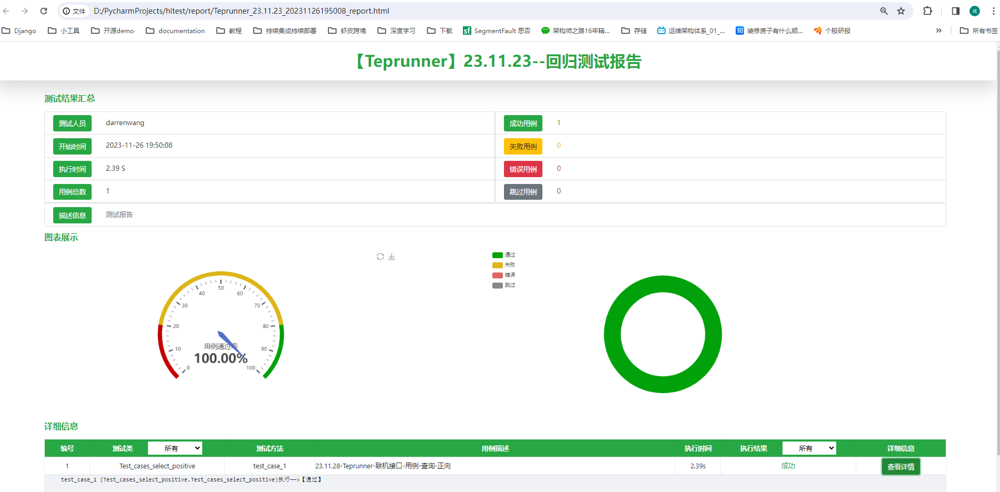

# hitest

#### 介绍
自动化测试工程，基于unittest，支持pycharm上单个用例、单个py文件的debug，支持testsuite跑批，支持用例打标与筛选执行，可出测试报告

#### 软件架构  
温馨提示：如果工程中的截图显示不了，请确认实在vpn网络下

#### 安装教程

1.  git clone https://github.com/darrenWang0827/hitest.git
2.  pip3 install -r requirements.txt

#### 使用说明

前提说明：  
本自动化测试工程，仅写了接口测试一个例子，管理台web和异步任务部分，请自行编写  
测试目标平台是来自dongfanger的https://github.com/dongfanger/teprunner-backend.git， 请自行安装部署，感谢dongfanger  
具体使用：
1.  配置项目  
data.Teprunner_DataManager.py 中配置你项目相关的API地址、数据库配置，Teprunner是项目名称
2.  编写接口资源  
编写一个平台基础客户端类，resource.TeprunnerBaseClient.py，里边封装了应用的get、post、put、delete请求，登录方法，数据库客户端实例  
编写各个API接口的资源类（给测试用例导入使用，组合使用）resource.Teprunner.Lib_api_teprunner_cases.py，API资源类继承平台基础客户端类，只定义API地址、基础报文
3.  编写测试用例  
Test_cases_select_positive.py 编写一个类，继承unittest.TestCase(),文件中可以导入前面编写的各个API接口资源，支持修改url和请求报文，然后发送请求，针对相应报文进行assert
4.  用例调试  
  
5.  执行  
方式一：单个测试用例的方法体内，右键执行  
方式二：单个测试用例集文件的main方法处，右键开始执行该文件中所有测试用例  
方式三：run_teprunner_regress.py 执行，该方法支持用例目录选择、用例标签列表筛选、用例文件匹配表达式筛选等，请仔细查看  
 
6.  查看测试报告  
方式三执行测试用例完毕后，程序会自动打开浏览器来展示测试用例执行结果  

7.  其他功能说明  
更多的工具包，放在util目录下了，可以自行查看。  
您可以加上邮件通知、企业微信通知等功能

#### 技术交流  
本人QQ: 770230625  
本人wechat：darrenwang0827  
欢迎来交流  

#### 参与贡献

1.  Fork 本仓库
2.  新建 Feat_xxx 分支
3.  提交代码
4.  新建 Pull Request

#### 特技

1.  使用 Readme\_XXX.md 来支持不同的语言，例如 Readme\_en.md, Readme\_zh.md
2.  Gitee 官方博客 [blog.gitee.com](https://blog.gitee.com)
3.  你可以 [https://gitee.com/explore](https://gitee.com/explore) 这个地址来了解 Gitee 上的优秀开源项目
4.  [GVP](https://gitee.com/gvp) 全称是 Gitee 最有价值开源项目，是综合评定出的优秀开源项目
5.  Gitee 官方提供的使用手册 [https://gitee.com/help](https://gitee.com/help)
6.  Gitee 封面人物是一档用来展示 Gitee 会员风采的栏目 [https://gitee.com/gitee-stars/](https://gitee.com/gitee-stars/)
